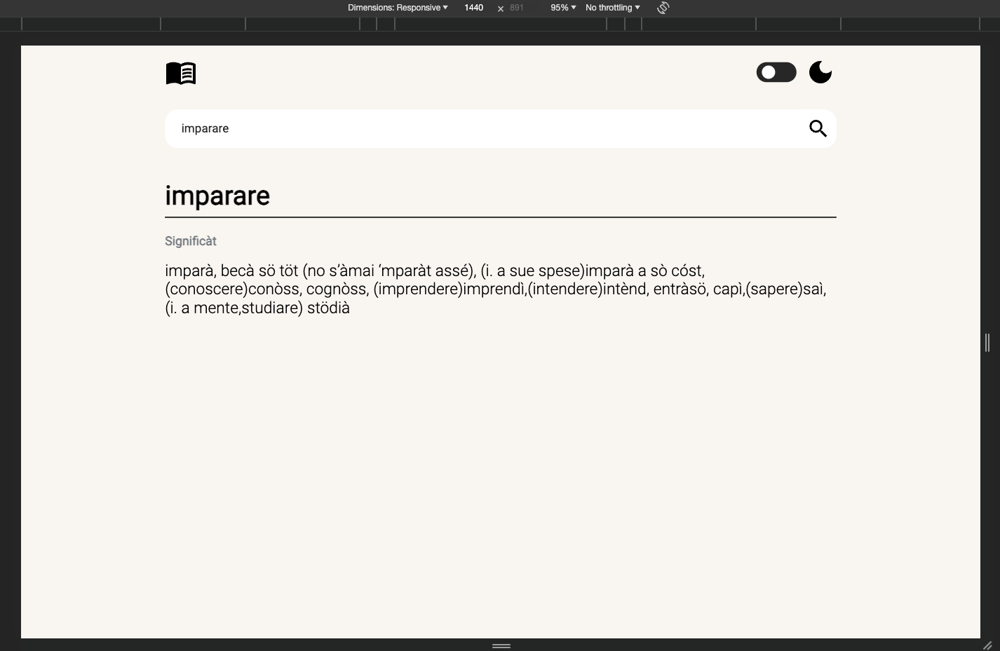
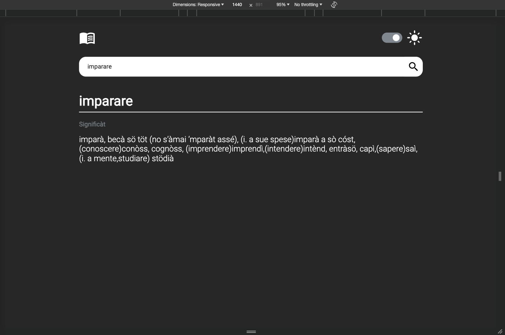
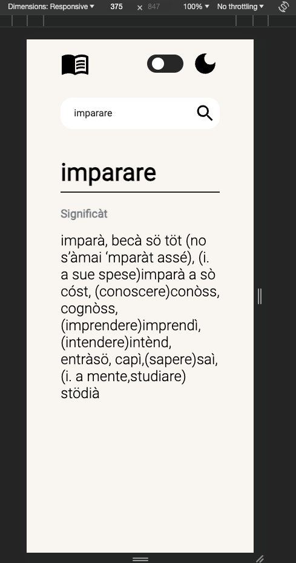
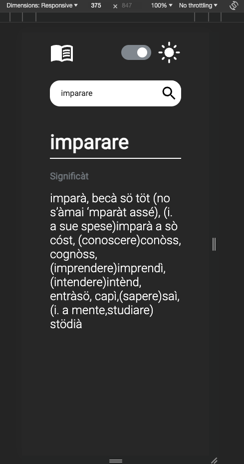

## Table of contents

- [Overview](#overview)
  - [The challenge](#the-challenge)
  - [Screenshot](#screenshot)
  - [Links](#links)
- [My process](#my-process)
  - [Built with](#built-with)
  - [What I learned](#what-i-learned)
- [Author](#author)

## Overview

This project represents a web page for a vocabulary app. The web application is developed for desktop and mobile screen sizes.

### The challenge

Users should be able to:

- View the optimal layout for the interface depending on their device's screen size
- See hover states for all interactive elements on the page
- Search for a specific italian word and get the translation into bergamasco
- Switch between dark mode and bright mode

### Screenshot

#### Desktop version

#### Mobile version

### Links

- Solution URL: [Solution URL here](https://github.com/AlinaAlexandraVizireanu/vocabulary-app)
- Live Site URL: [Live site URL here](https://alinaalexandravizireanu.github.io/vocabulary-app/)

## My process

Starting from https://www.ducatodipiazzapontida.it/cultura-tradizioni-folclore/vocabolario-italiano-bergamasco/ I decided to build a vocabulary app from which you can search italian words and get the translation in bergamasco.
The process of getting all the words and their meaning from the original website was done through web scraping into a JSON file.
After having all data in data.json file I started to build the webpage with HTML and design it with CSS.
The logic part of the project was done with JavaScript.

### Built with

- Semantic HTML5 markup
- CSS custom properties
- axios

### What I learned

In the process of building the webpage I learned to get the data from websites through web scraping, I also improved my knowledge working with axios, objects and JSON files.

## Author

- Website - [Alina Alexandra VIZIREANU](https://alinaalexandravizireanu.github.io/vocabulary-app/)